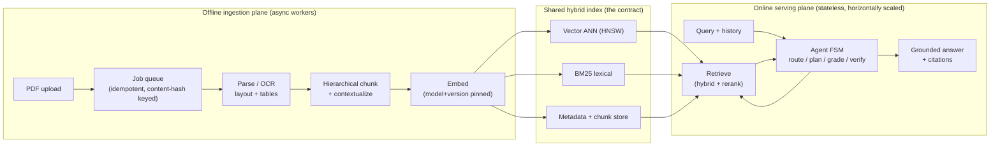
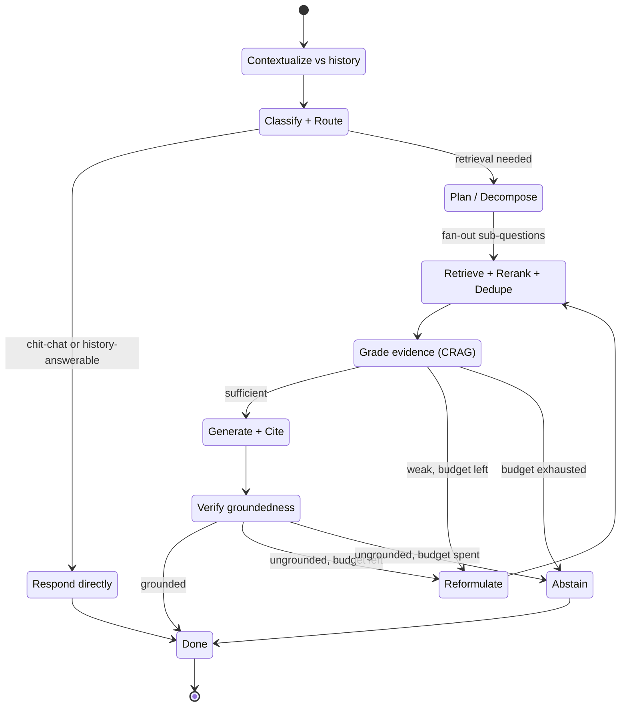

# agrag — Agentic, document-grounded RAG over PDFs

A document-grounded QA **agent** over arbitrary PDFs (scanned, multi-column, table-heavy, multilingual) on a **self-hosted open-weights stack** (Ollama + a 12B multimodal Gemma). What makes it *not* vanilla RAG: the answer path is a **bounded, self-correcting finite-state machine** — classify intent → pick a retrieval strategy → decompose → retrieve → grade evidence (Corrective-RAG) → reformulate on weak evidence → generate with citations → verify entailment → answer or **abstain ("not stated in the document")** — all under a hard iteration cap + wall-clock + token budget so it *provably terminates*. Every capability is reported as a **quantified delta over a vanilla single-shot RAG control** that is built first and kept behind the same interfaces. Bar: **faithfulness ≥ 0.9, recall@10 > baseline, correct-refusal ≥ 0.8.**

> Everything sits behind swappable interfaces (dependency inversion + feature flags), so the whole system runs in **local mode with zero external services and no GPU** — deterministic LLM, hash embeddings, in-memory stores — and flips to the full self-hosted stack with a config change.

---

## Architecture

Two independent planes — an **offline ingestion plane** that turns messy PDFs into a queryable index, and an **online serving plane** that runs the agent — meet at exactly one shared artifact: the **hybrid index**.



The agent is an explicit finite-state machine (not a free-form ReAct scratchpad): named states, typed transitions, terminal conditions, one shared `Budget` threaded through every node. It can exit only three ways — sufficient evidence, iteration cap hit, or deadline exceeded — so termination is enforced by the harness, never requested of the model.



The inner cycle `Grade → Reformulate → Retrieve` is Corrective-RAG (fix *retrieval* before generating); the outer cycle `Verify → Reformulate → Retrieve` is Self-RAG (fix a *draft* that turned out ungrounded). Both decrement the same iteration counter and share one `Budget`.

---

## Quickstart — local mode (no GPU, no services)

Local mode wires dependency-light fallbacks (deterministic fake LLM, hash embeddings, in-memory vector/lexical/doc stores, lexical verifier, logging tracer) so the full pipeline runs on a laptop with nothing else installed.

```bash
python3 -m venv .venv
source .venv/bin/activate
pip install -e '.[dev]'          # or: make install

# Ingest a plain-text doc and ask a question (AGRAG_CONFIG defaults to config/default.yaml).
mkdir -p data
echo "Acme Corp reported revenue of 42 million dollars in fiscal year 2023." > data/sample.txt
agrag ingest data/sample.txt
agrag ask "What was Acme's FY2023 revenue?"
```

Via the Makefile:

```bash
make install
make ingest DOC=data/sample.txt
make ask Q="What was Acme's FY2023 revenue?"
make run          # serve the API locally: uvicorn agrag.serving.app:app (config/default.yaml)
```

No GPU is touched: the `fake` LLM is deterministic, embeddings are hashed, and stores are in-memory. This is the substrate the CI eval gate and the frozen golden set run against.

---

## Full mode — self-hosted stack

Full mode wires **Ollama + `gemma3:12b`** (multimodal, multilingual; optional `gemma3:4b` cascade), **BGE-M3** dense+sparse embeddings, a **BGE-reranker-v2** cross-encoder, **Qdrant** for vectors, **Redis** for cache/single-flight, an **NLI entailment verifier**, and **Langfuse** (self-host) for tracing. See [`config/full.yaml`](config/full.yaml).

```bash
cp .env.example .env             # edit the placeholder secrets
docker compose up -d             # Ollama, Qdrant, Redis, Langfuse (+ Postgres), app
make pull-models                 # pull gemma3:12b + gemma3:4b into the ollama volume

# Point the app at the real stack:
export AGRAG_CONFIG=config/full.yaml
export AGRAG_MODE=full
```

Running the app on the host (outside Docker) instead of the `app` container needs the heavy extras:

```bash
make install-full                # pip install -e '.[ml,pdf,stores,obs,eval,dev]'
# GPU torch is installed separately, matched to your CUDA driver, e.g.:
#   pip install --index-url https://download.pytorch.org/whl/cu121 torch
```

Optional dependencies map to extras: `pdf` (PyMuPDF/pdfplumber/OCR), `ml` (torch/FlagEmbedding/transformers), `stores` (qdrant-client/redis), `obs` (otel/langfuse), `eval` (ragas/datasets). Heavy libs are imported lazily, so `import agrag` succeeds even when an extra is absent — the error surfaces only if you *select* that provider.

| Service | Image | Port(s) |
|---|---|---|
| Ollama (LLM) | `ollama/ollama` | 11434 |
| Qdrant (vectors) | `qdrant/qdrant` | 6333 / 6334 |
| Redis (cache) | `redis:7-alpine` | 6379 |
| Langfuse (tracing) | `langfuse/langfuse` + `postgres:16` | 3000 |
| app (agrag API) | built from `Dockerfile` | 8000 |

---

## HTTP API

`make run` (or `uvicorn agrag.serving.app:app`) serves a stateless FastAPI app — state lives in the backing stores, so any replica serves any request identically.

| Method | Path | Purpose |
|---|---|---|
| `GET` | `/health` | Liveness + current mode/agent-mode + indexed chunk count |
| `POST` | `/ingest` | Ingest a document: `{"text": "..."}` inline, or `{"content_base64": "..."}` for binary (PDF); returns a `JobHandle` |
| `GET` | `/docs/{tenant_id}/{doc_id}` | Ingestion status + page progress for an async job |
| `POST` | `/ask` | Ask a question: `{"query": "...", "history": [...], "tenant_id": "..."}`; returns a structured `Answer` with claims + citations |

```bash
curl -s localhost:8000/ingest -H 'content-type: application/json' \
  -d '{"text": "Acme Corp reported revenue of 42 million dollars in FY2023.", "filename": "acme.txt"}'

curl -s localhost:8000/ask -H 'content-type: application/json' \
  -d '{"query": "What was Acme'\''s FY2023 revenue?"}'
```

An `Answer` is either `answered` — with per-claim citations (`chunk_id`, page, verbatim quote) and any sandbox `computations` — or `abstained` with a machine-readable reason (`no_evidence`, `contradicted`, `budget_abstain`, `still_indexing`).

---

## CLI

```
agrag ingest <path> [--tenant T] [--config cfg.yaml]     # ingest a document
agrag ask "<question>" [--path doc]                       # ask (optionally ingest doc first)
agrag eval [--golden f.jsonl] [--corpus f.jsonl]          # baseline-vs-agentic eval delta
agrag serve                                               # run the FastAPI server
```

---

## Configuration

Settings load from a YAML file (`--config`, else `$AGRAG_CONFIG`, else [`config/default.yaml`](config/default.yaml)), then `AGRAG_*` environment variables override individual keys: `AGRAG_LLM_PROVIDER=ollama` maps to `llm.provider`, `AGRAG_AGENT_MODE=baseline` to `agent_mode`, with bool/int/float coercion.

Selected knobs (see [`src/agrag/config.py`](src/agrag/config.py) for the full set):

| Key | Default | Meaning |
|---|---|---|
| `mode` | `local` | `local` (dependency-light fallbacks) vs `full` (real services) |
| `agent_mode` | `agentic` | `agentic` FSM vs `baseline` vanilla control |
| `agent.max_iters` / `wall_clock_s` / `token_budget` | 3 / 30s / 20k | The hard budget every query runs under |
| `retrieval.over_fetch` → `top_k` | 100 → 8 | The retrieve→rerank funnel width |
| `cache.semantic_threshold` | 0.97 | Semantic-cache similarity floor (correctness-critical) |
| `parser.max_upload_mb` / `parse_timeout_s` | 100 / 120s | PDF-bomb guards |
| `verifier.tau_entail` / `tau_contra` | — | Entailment thresholds; the gray zone abstains |

---

## Evaluation

The eval harness runs the same golden set through **both** the vanilla baseline and the agentic FSM and reports per-metric deltas — the project's core claim is that delta, not an absolute score.

```bash
agrag eval        # or: make eval
```

Metrics per item, aggregated: `token_f1` / `exact_match` vs gold answers, `recall@k` + `context_precision` vs gold chunk ids, `faithfulness` + `citation_accuracy` (are quotes really in the cited chunks?), `correct_refusal` on unanswerable items, and `over_abstention` on answerable ones. The golden set (`data/golden/`) is frozen fixture data; `eval/gate.py` holds the regression floors intended for CI.

---

## Concept ledger (C1–C31) → modules

Every design choice carries a stable concept ID. Grouped, with where each group lives in the package:

| Group | Concepts | Maps to |
|---|---|---|
| **A · Vector search & retrieval** | C1 ANN triangle · C2 quantization · C3 embedding versioning · C4 retrieve→rerank · C5 RRF fusion · C6 near-dup dedupe | `adapters/vectorstore/*`, `adapters/lexical/bm25.py`, `adapters/reranker/*`, `retrieval/hybrid.py`, `contracts/chunk.py` (`embedding_model`+`version`) |
| **B · Concurrency** | C7 async fan-out/fan-in · C8 backpressure (GPU-slot semaphore) · C9 CPU/GPU vs I/O separation | `agent/app.py`, `serving/app.py`, `ingestion/service.py` |
| **C · Reliability** | C10 idempotency · C11 backoff+jitter · C12 circuit breaker · C13 deadline propagation · C14 fallback cascade · C15 queue load-leveling | `contracts/budget.py` (`Deadline`), `ingestion/service.py` (content-hash), `adapters/llm/*` |
| **D · Data & caching** | C16 read-your-writes · C17 cache invalidation · C18 multi-level + semantic cache · C19 single-flight · C20 Merkle-diff re-index | `adapters/cache/*`, `adapters/docstore/*`, `ingestion/service.py` |
| **E · Software design** | C21 dependency inversion · C22 strategy + feature flags · C23 agent-as-FSM · C24 pipeline/chain-of-responsibility | `interfaces/*`, `deps.py`, `container.py`, `config.py`, `agent/app.py`, `ingestion/*` |
| **F · Observability & eval** | C25 tracing + correlation IDs · C26 p50/p95/p99 + cost SLOs · C27 eval regression gates · C28 deterministic testing / validated judge | `adapters/tracer/*`, `eval/`, `adapters/verifier/*` |
| **G · Security** | C29 injection defense (data ≠ code) · C30 sandboxed code exec · C31 multi-tenancy isolation | `tools/sandbox.py`, `promptfmt.py` (role separation), tenant filters in `adapters/vectorstore|lexical|docstore/*` |

---

## Roadmap status

Three milestones, nine steps, each gated by a *Done-when* and the single metric it must move. Status reflects the current build.

| Step | Milestone | What it adds | Metric to move | Status |
|---|---|---|---|---|
| 1 · Baseline RAG | M1 Foundation | Fixed-chunk → embed → top-k → grounded prompt control, behind strategy interfaces; frozen golden set | Baseline faithfulness + correctness | 🟡 In progress |
| 2 · Robust ingestion | M1 Foundation | Layout parse, OCR routing, table extraction, boilerplate strip, hierarchical chunk; idempotent content-hashed jobs + Merkle diff | Table-QA correctness; coverage | ⚪ Planned |
| 3 · Hybrid + rerank | M1 Foundation | BM25 + dense fused by RRF, cross-encoder rerank, MinHash dedupe, metadata filters | recall@k, nDCG, exact-match | ⚪ Planned |
| 4 · Plan + grade | M2 Agentic core | Router + decomposition + CRAG grader as an FSM (iter cap + deadline); sandboxed code tool | Multi-hop / aggregation correctness | ⚪ Planned |
| 5 · Verify + abstain | M2 Agentic core | NLI groundedness verifier, per-claim citation matching, calibrated abstention | Faithfulness; correct/false-refusal | ⚪ Planned |
| 6 · Multi-turn | M2 Agentic core | Externalized conversation state + follow-up rewriting | Follow-up resolution | ⚪ Planned |
| 7 · Advanced retrieval | M3 Scale + harden | ONE differentiator (ColPali / GraphRAG / RAPTOR) by dominant eval failure | Target-class metric (no regression) | ⚪ Planned |
| 8 · Eval + tracing | M3 Scale + harden | Benchmark suite, OTel spans, p95/p99 + cost dashboard, CI regression gates | p95/p99, cost/query, trace coverage | ⚪ Planned |
| 9 · Harden + scale | M3 Scale + harden | Injection defense, tenant isolation, GPU-slot backpressure, cascade, caching + invalidation, ANN/quant tuning | Injection success → 0; cross-tenant leaks = 0 | ⚪ Planned |

**Foundation substrate (done):** typed data contracts, the `LLM`/`EmbeddingModel`/`VectorStore`/`LexicalIndex`/`DocStore`/`Cache`/`Parser`/`Chunker`/`Retriever`/`Reranker`/`Grader`/`Verifier`/`ToolRunner`/`Tracer` interfaces, the feature-flagged composition root (`container.py`), config loading with env overrides, and local-mode fallback adapters (fake LLM, hash embeddings, in-memory stores) — the C21/C22/C23 backbone every step swaps into.

---

## Repo layout

```
AgenticRag/
├── config/
│   ├── default.yaml            # local mode: dep-light fallbacks, no GPU/services
│   └── full.yaml               # full mode: Ollama + Qdrant + Redis + BGE + NLI + Langfuse
├── docker-compose.yml          # Ollama, Qdrant, Redis, Langfuse(+Postgres), app
├── Dockerfile                  # python:3.12-slim + pdf/ocr sys deps + [pdf,stores,obs]
├── Makefile                    # venv / install / pull-models / up / run / ingest / ask / eval
├── pyproject.toml              # package + optional extras (ml, pdf, stores, obs, eval, dev)
└── src/agrag/
    ├── config.py               # Settings + per-section configs; YAML + AGRAG_* env overrides (C22)
    ├── container.py            # composition root: pick concretes from flags, lazy imports (C21)
    ├── deps.py                 # Deps bundle of interfaces threaded through every service
    ├── promptfmt.py            # prompt role separation / data-vs-instruction delimiting (C29)
    ├── contracts/              # typed data contracts (the API between planes)
    │   ├── chunk.py  document.py  query.py  evidence.py
    │   ├── answer.py  parsed.py  session.py  budget.py   # budget.py = Deadline (C13)
    ├── interfaces/             # the Protocols — every layer depends on these, never a library (C21)
    │   ├── models.py           #   LLM, EmbeddingModel
    │   ├── storage.py          #   VectorStore, LexicalIndex, DocStore, Cache
    │   ├── pipeline.py         #   Parser, Chunker, Retriever, Reranker, Grader, Verifier, ToolRunner, Tracer
    │   └── types.py            #   LLMResult, EmbeddingResult, VectorRecord, ToolResult, VerdictResult, SparseVector
    └── adapters/               # concrete strategies behind the interfaces (C22)
        ├── llm/                #   fake (local) | ollama
        ├── embedding/          #   hash (local) | bge_m3
        ├── vectorstore/        #   memory (local) | qdrant   (+ filters.py: tenant scoping, C31)
        ├── lexical/            #   bm25
        ├── docstore/           #   memory (local) | redis
        ├── reranker/           #   identity (local) | bge
        ├── verifier/           #   lexical (local) | nli
        ├── cache/              #   memory (local) | redis
        ├── tracer/             #   logging (local) | langfuse
        └── parser/             #   text (local) | pymupdf
```

Additional packages the composition root wires as the roadmap lands: `ingestion/` (chunker + idempotent service), `retrieval/hybrid.py` (RRF fuse + rerank + dedupe), `agent/` (grader + FSM app), `baseline/vanilla.py` (the control), `tools/sandbox.py`, `serving/app.py` (FastAPI), `cli.py`, and `eval/` (golden-set harness).

---

## License

MIT
