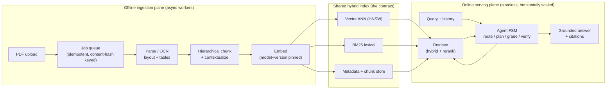
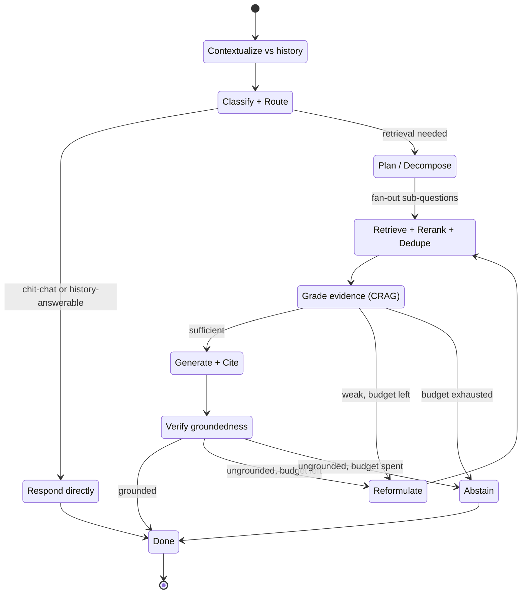
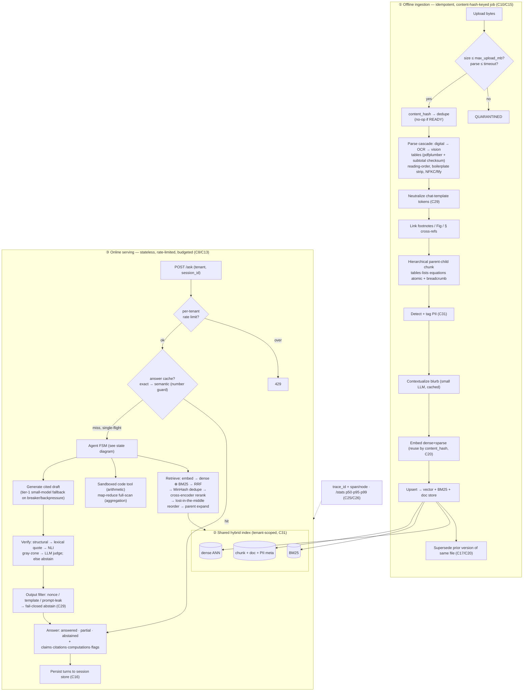

# agrag — Agentic, document-grounded RAG over PDFs

A document-grounded QA **agent** over arbitrary PDFs (scanned, multi-column, table-heavy, multilingual) on a **self-hosted open-weights stack** (Ollama + a 12B multimodal Gemma). What makes it *not* vanilla RAG: the answer path is a **bounded, self-correcting finite-state machine** — classify intent → pick a retrieval strategy → decompose → retrieve → grade evidence (Corrective-RAG) → reformulate on weak evidence → generate with citations → verify entailment → answer or **abstain ("not stated in the document")** — all under a hard iteration cap + wall-clock + token budget so it *provably terminates*. Every capability is reported as a **quantified delta over a vanilla single-shot RAG control** that is built first and kept behind the same interfaces. Bar: **faithfulness ≥ 0.9, recall@10 > baseline, correct-refusal ≥ 0.8.**

> Everything sits behind swappable interfaces (dependency inversion + feature flags), so the whole system runs in **local mode with zero external services and no GPU** — deterministic LLM, hash embeddings, in-memory stores — and flips to the full self-hosted stack with a config change.

---

## Architecture

Two independent planes — an **offline ingestion plane** that turns messy PDFs into a queryable index, and an **online serving plane** that runs the agent — meet at exactly one shared artifact: the **hybrid index**.



The agent is an explicit finite-state machine (not a free-form ReAct scratchpad): named states, typed transitions, terminal conditions, one shared `Budget` threaded through every node. It can exit only three ways — sufficient evidence, iteration cap hit, or deadline exceeded — so termination is enforced by the harness, never requested of the model.



The inner cycle `Grade → Reformulate → Retrieve` is Corrective-RAG (fix *retrieval* before generating); the outer cycle `Verify → Reformulate → Retrieve` is Self-RAG (fix a *draft* that turned out ungrounded). Both decrement the same iteration counter and share one `Budget`.

### End-to-end pipeline flow

The full path a byte takes from upload to a cited answer, across both planes and every hardening layer.



Every model call in ③ is guarded by a circuit breaker, deadline-gated retries with jitter, and a GPU-slot semaphore that sheds to backpressure — degrading down a fixed ladder (12B → small model → cache → honest abstention) rather than failing hard.

---

## Quickstart — local mode (no GPU, no services)

Local mode wires dependency-light fallbacks (deterministic fake LLM, hash embeddings, in-memory vector/lexical/doc stores, lexical verifier, logging tracer) so the full pipeline runs on a laptop with nothing else installed.

```bash
python3 -m venv .venv
source .venv/bin/activate
pip install -e '.[dev]'          # or: make install

# Ingest a plain-text doc and ask a question (AGRAG_CONFIG defaults to config/default.yaml).
mkdir -p data
echo "Acme Corp reported revenue of 42 million dollars in fiscal year 2023." > data/sample.txt
agrag ingest data/sample.txt
agrag ask "What was Acme's FY2023 revenue?"
```

Via the Makefile:

```bash
make install
make ingest DOC=data/sample.txt
make ask Q="What was Acme's FY2023 revenue?"
make run          # serve the API locally: uvicorn agrag.serving.app:app (config/default.yaml)
```

No GPU is touched: the `fake` LLM is deterministic, embeddings are hashed, and stores are in-memory. This is the substrate the CI eval gate and the frozen golden set run against.

---

## Full mode — self-hosted stack

Full mode wires **Ollama + `gemma3:12b`** (multimodal, multilingual; optional `gemma3:4b` cascade), **BGE-M3** dense+sparse embeddings, a **BGE-reranker-v2** cross-encoder, **Qdrant** for vectors, **Redis** for cache/single-flight, an **NLI entailment verifier**, and **Langfuse** (self-host) for tracing. See [`config/full.yaml`](config/full.yaml).

```bash
cp .env.example .env             # edit the placeholder secrets
docker compose up -d             # Ollama, Qdrant, Redis, Langfuse (+ Postgres), app
make pull-models                 # pull gemma3:12b + gemma3:4b into the ollama volume

# Point the app at the real stack:
export AGRAG_CONFIG=config/full.yaml
export AGRAG_MODE=full
```

Running the app on the host (outside Docker) instead of the `app` container needs the heavy extras:

```bash
make install-full                # pip install -e '.[ml,pdf,stores,obs,eval,dev]'
# GPU torch is installed separately, matched to your CUDA driver, e.g.:
#   pip install --index-url https://download.pytorch.org/whl/cu121 torch
```

Optional dependencies map to extras: `pdf` (PyMuPDF/pdfplumber/OCR), `ml` (torch/FlagEmbedding/transformers), `stores` (qdrant-client/redis), `obs` (otel/langfuse), `eval` (ragas/datasets). Heavy libs are imported lazily, so `import agrag` succeeds even when an extra is absent — the error surfaces only if you *select* that provider.

| Service | Image | Port(s) |
|---|---|---|
| Ollama (LLM) | `ollama/ollama` | 11434 |
| Qdrant (vectors) | `qdrant/qdrant` | 6333 / 6334 |
| Redis (cache) | `redis:7-alpine` | 6379 |
| Langfuse (tracing) | `langfuse/langfuse` + `postgres:16` | 3000 |
| app (agrag API) | built from `Dockerfile` | 8000 |

---

## HTTP API

`make run` (or `uvicorn agrag.serving.app:app`) serves a stateless FastAPI app — state lives in the backing stores, so any replica serves any request identically.

| Method | Path | Purpose |
|---|---|---|
| `GET` | `/health` | Liveness + current mode/agent-mode + indexed chunk count |
| `GET` | `/stats` | Rolling p50/p95/p99 latency, abstention/cache-hit/degraded rates (C26) |
| `POST` | `/ingest` | Ingest a document: `{"text": "..."}` inline, or `{"content_base64": "..."}` for binary (PDF); returns a `JobHandle` |
| `GET` | `/docs/{tenant_id}/{doc_id}` | Ingestion status + page progress for an async job |
| `POST` | `/ask` | Ask a question: `{"query": "...", "session_id": "...", "history": [...], "tenant_id": "..."}`; returns a structured `Answer`. Pass `session_id` for server-side multi-turn (history is loaded/persisted server-side); rate-limited per tenant (429 on breach). |

```bash
curl -s localhost:8000/ingest -H 'content-type: application/json' \
  -d '{"text": "Acme Corp reported revenue of 42 million dollars in FY2023.", "filename": "acme.txt"}'

curl -s localhost:8000/ask -H 'content-type: application/json' \
  -d '{"query": "What was Acme'\''s FY2023 revenue?"}'
```

An `Answer` is either `answered`/`partial` — with per-claim citations (`chunk_id`, page, verbatim quote) and any sandbox `computations` — or `abstained` with a machine-readable reason (`no_evidence`, `contradicted`, `budget_abstain`, `still_indexing`, `injection_suspected`). It also carries `from_cache` and `degraded` (served by the small-model fallback tier) flags.

---

## CLI

```
agrag ingest <path> [--tenant T] [--config cfg.yaml]         # ingest a document
agrag ask "<question>" [--path doc]                           # ask (optionally ingest doc first)
agrag eval [--gate] [--golden f] [--corpus f] [--control f]   # baseline-vs-agentic delta; --gate exits 1 on regression
agrag calibrate --labels labels.jsonl [--beta 0.5]            # sweep TAU_ENTAIL + judge↔human Cohen's κ (C28)
agrag recall [--k 10] [--corpus f]                            # ANN recall@k vs brute-force exact (C1)
agrag serve                                                   # run the FastAPI server
```

---

## Reliability & graceful degradation

Because the scarce resource is GPU-seconds under a fixed slot pool (not API dollars), every model call runs behind three primitives in [`reliability/`](src/agrag/reliability/):

- **Circuit breaker** (`breaker.py`) — per-dependency Closed→Open→HalfOpen; an unhealthy server fails fast to the next tier instead of burning the deadline.
- **Deadline-gated retries** (`retry.py`) — only *retriable* faults retry, with exponential backoff + full jitter, and never an attempt that can't finish before the deadline.
- **GPU-slot admission pool** (`slots.py`) — bounded concurrency; a slot not free within the queue budget raises `Backpressure` rather than relocating the queue into the GPU.

These compose into a fixed **degradation ladder** (07 §2.5): full 12B agentic answer → small-model generation (answer flagged `degraded`) → cached answer → honest abstention. The generator ([`grounding/generator.py`](src/agrag/grounding/generator.py)) falls back to `small_llm` on any breaker/backpressure/retry-exhausted signal; the loop still verifies, so a degraded answer is still grounded-or-abstained.

## Security (defense-in-depth, structural not prompted)

Two untrusted surfaces — uploaded PDF text and model-generated tool code — are both treated as hostile ([`security/`](src/agrag/security/), [`tools/sandbox.py`](src/agrag/tools/sandbox.py)):

- **Injection (C29):** chat-template control tokens are neutralized at ingest (`sanitize.py`), evidence is spotlighted behind a per-request nonce and delimited as data, tool names/citation IDs are grammar-constrained to an allowlist, and a post-hoc **output filter** (`output_filter.py`) fails the query *closed* to abstention if the answer leaks the nonce, a template token, or a system-prompt fingerprint.
- **Sandbox (C30):** the arithmetic tool AST-validates (no imports/attributes/dunders) then runs in a network-denied, resource-capped subprocess (gVisor/Firecracker are the drop-in production isolation behind the same interface).
- **Tenancy (C31):** every vector/lexical/doc/session/cache lookup is tenant-scoped; the mandatory filter is a security boundary, not an optimization.
- **PII (`pii.py`):** email/SSN/phone/Luhn-card detection tags chunk metadata at ingest (tag-and-restrict).
- **PDF-bomb:** upload-size + per-parse wall-clock caps quarantine oversized/slow inputs before they touch a worker.

---

## Configuration

Settings load from a YAML file (`--config`, else `$AGRAG_CONFIG`, else [`config/default.yaml`](config/default.yaml)), then `AGRAG_*` environment variables override individual keys: `AGRAG_LLM_PROVIDER=ollama` maps to `llm.provider`, `AGRAG_AGENT_MODE=baseline` to `agent_mode`, with bool/int/float coercion.

Selected knobs (see [`src/agrag/config.py`](src/agrag/config.py) for the full set):

| Key | Default | Meaning |
|---|---|---|
| `mode` | `local` | `local` (dependency-light fallbacks) vs `full` (real services) |
| `agent_mode` | `agentic` | `agentic` FSM vs `baseline` vanilla control |
| `agent.max_iters` / `wall_clock_s` / `token_budget` | 3 / 30s / 20k | The hard budget every query runs under |
| `retrieval.over_fetch` → `top_k` | 100 → 8 | The retrieve→rerank funnel width |
| `cache.answers_enabled` / `semantic_enabled` / `semantic_threshold` | true / true / 0.97 | Answer cache; semantic floor is correctness-critical |
| `parser.max_upload_mb` / `parse_timeout_s` | 100 / 120s | PDF-bomb guards |
| `verifier.tau_entail` / `tau_contra` / `judge_gray_zone` | 0.85 / 0.10 / true | Entailment thresholds; gray zone escalates to the LLM judge then abstains |
| `reliability.max_retries` / `breaker_failures` / `slot_wait_fraction` | 2 / 5 / 0.3 | Retry, circuit-breaker trip, backpressure queue budget |
| `agent.max_scan_chunks` | 500 | Aggregation full-scan bound (truncation is logged, never silent) |
| `serving.rate_limit_qpm` | 0 (off) | Per-tenant queries/minute cap (denial-of-GPU guard) |

---

## Evaluation

The eval harness runs the same golden set through **both** the vanilla baseline and the agentic FSM and reports per-metric deltas — the project's core claim is that delta, not an absolute score.

```bash
agrag eval        # or: make eval
```

Metrics per item, aggregated: `token_f1` / `exact_match` vs gold answers, `recall@k` + `context_precision` vs gold chunk ids, `faithfulness` + `citation_accuracy` (are quotes really in the cited chunks?), `correct_refusal` on unanswerable items, and `over_abstention` on answerable ones. The golden set (`data/golden/`) is frozen fixture data (question set, corpus, and an injection corpus for the security surface).

**CI regression gate.** [`.github/workflows/ci.yml`](.github/workflows/ci.yml) runs `ruff` then `agrag eval --gate`, which re-runs the frozen baseline as the live control and exits non-zero if the agentic run regresses any locked metric beyond tolerance ([`eval/gate.py`](src/agrag/eval/gate.py), C27). Because the local stack is fully deterministic (fake LLM + hashed embeddings), the gate is stable — no flakiness.

**Judge calibration (C28).** `agrag calibrate` sweeps `TAU_ENTAIL` off a labeled set (biased so a hallucination costs more than an over-abstention) and reports judge↔human Cohen's κ — a judge's scores don't count toward a metric until κ clears the bar ([`eval/calibration.py`](src/agrag/eval/calibration.py)).

**ANN recall (C1).** `agrag recall` measures recall@k of the ANN candidate generator against brute-force exact kNN — needs no human labels, and is meant to re-run after any index rebuild / quantization change / embedding swap ([`eval/recall.py`](src/agrag/eval/recall.py)).

---

## Concept ledger (C1–C31) → modules

Every design choice carries a stable concept ID. Grouped, with where each group lives in the package:

| Group | Concepts | Maps to |
|---|---|---|
| **A · Vector search & retrieval** | C1 ANN triangle · C2 quantization · C3 embedding versioning · C4 retrieve→rerank · C5 RRF fusion · C6 near-dup dedupe | `adapters/vectorstore/*`, `adapters/lexical/bm25.py`, `adapters/reranker/*`, `retrieval/hybrid.py`, `contracts/chunk.py` (`embedding_model`+`version`) |
| **B · Concurrency** | C7 async fan-out/fan-in · C8 backpressure (GPU-slot semaphore) · C9 CPU/GPU vs I/O separation | `agent/plan_exec.py` (fan-out), `reliability/slots.py`, `grounding/verify.py` (concurrent claims), `ingestion/stages.py` (`to_thread`) |
| **C · Reliability** | C10 idempotency · C11 backoff+jitter · C12 circuit breaker · C13 deadline propagation · C14 fallback cascade · C15 queue load-leveling | `ingestion/service.py` (content-hash), `reliability/{retry,breaker}.py`, `contracts/budget.py`, `adapters/llm/ollama.py`, `grounding/generator.py` (fallback), `ingestion/jobs.py` |
| **D · Data & caching** | C16 read-your-writes · C17 cache invalidation · C18 multi-level + semantic cache · C19 single-flight · C20 Merkle-diff re-index | `agent/answer_cache.py`, `adapters/{cache,docstore,session}/*`, `ingestion/{service,stages}.py` (embed reuse + supersede) |
| **E · Software design** | C21 dependency inversion · C22 strategy + feature flags · C23 agent-as-FSM · C24 pipeline/chain-of-responsibility | `interfaces/*`, `deps.py`, `container.py`, `config.py`, `agent/graph.py`, `ingestion/*` |
| **F · Observability & eval** | C25 tracing + correlation IDs · C26 p50/p95/p99 + cost SLOs · C27 eval regression gates · C28 deterministic testing / validated judge | `adapters/tracer/{logging,langfuse,otel}.py`, `serving/ops.py`, `eval/{gate,calibration,recall}.py` |
| **G · Security** | C29 injection defense (data ≠ code) · C30 sandboxed code exec · C31 multi-tenancy isolation | `security/{sanitize,output_filter,pii}.py`, `promptfmt.py`, `tools/sandbox.py`, tenant filters in `adapters/{vectorstore,lexical,docstore,session}/*` |

---

## Roadmap status

Three milestones, nine steps, each gated by a *Done-when* and the single metric it must move. ✅ implemented · 🟢 implemented, full-mode-quality unverified without a GPU box · ⚪ deferred.

| Step | Milestone | What it adds | Status |
|---|---|---|---|
| 1 · Baseline RAG | M1 Foundation | Fixed-chunk → embed → top-k → grounded prompt control, behind strategy interfaces; frozen golden set | ✅ |
| 2 · Robust ingestion | M1 Foundation | Layout parse + OCR/vision cascade, table extraction + subtotal checksum, boilerplate strip, cross-ref/footnote linking, equation/list atomic chunks, hierarchical chunk; idempotent content-hashed jobs, per-chunk embed reuse, supersede-on-edit | ✅ |
| 3 · Hybrid + rerank | M1 Foundation | BM25 + dense fused by RRF, cross-encoder rerank, MinHash dedupe, metadata/self-query filters, lost-in-the-middle reorder | ✅ |
| 4 · Plan + grade | M2 Agentic core | Router + decomposition + concurrent fan-out + CRAG grader as a LangGraph FSM (iter cap + deadline); sandboxed code tool; aggregation map-reduce full-scan | ✅ |
| 5 · Verify + abstain | M2 Agentic core | NLI/lexical groundedness verifier + gray-zone judge escalation, per-claim citation matching, calibrated abstention + κ/τ calibration tooling | ✅ |
| 6 · Multi-turn | M2 Agentic core | Server-side session store (memory/redis) + follow-up rewriting (coref/ellipsis) | ✅ |
| 7 · Advanced retrieval | M3 Scale + harden | ONE differentiator (ColPali / GraphRAG / RAPTOR) chosen by dominant eval failure | ⚪ deferred (chosen from eval data) |
| 8 · Eval + tracing | M3 Scale + harden | Eval harness + delta, CI regression gate, OTel spans, `/stats` p50/p95/p99 + rates, ANN-recall + judge-κ tooling | 🟢 (real benchmark datasets pending; synthetic golden set today) |
| 9 · Harden + scale | M3 Scale + harden | Layered injection defense + output filter, tenant isolation, GPU-slot backpressure + circuit breaker + retries, small→large cascade, answer cache + invalidation + single-flight, per-tenant rate limits, PDF-bomb caps, ANN-recall measurement | ✅ |

**Only genuine gap:** step 7's one advanced retrieval differentiator (intentionally last — the roadmap picks it from the dominant eval-failure class) and swapping the synthetic golden set for the real benchmark suites (FinanceBench / TAT-QA / ConvFinQA / DocVQA). Everything else across all nine steps is implemented behind the swappable interfaces and exercised in local mode; full-mode *answer quality* (real Gemma + BGE + NLI + Qdrant) is the only thing that needs a GPU box to validate.

---

## Repo layout

```
AgenticRag/
├── config/
│   ├── default.yaml            # local mode: dep-light fallbacks, no GPU/services
│   └── full.yaml               # full mode: Ollama + Qdrant + Redis + BGE + NLI + Langfuse
├── docker-compose.yml          # Ollama, Qdrant, Redis, Langfuse(+Postgres), app
├── Dockerfile                  # python:3.12-slim + pdf/ocr sys deps + [pdf,stores,obs]
├── Makefile                    # venv / install / pull-models / up / run / ingest / ask / eval
├── pyproject.toml              # package + optional extras (ml, pdf, stores, obs, eval, dev)
└── src/agrag/
    ├── config.py               # Settings + per-section configs; YAML + AGRAG_* env overrides (C22)
    ├── container.py            # composition root: pick concretes from flags, lazy imports (C21)
    ├── deps.py                 # Deps bundle of interfaces threaded through every service
    ├── promptfmt.py            # prompt role separation / data-vs-instruction delimiting (C29)
    ├── contracts/              # typed data contracts (the API between planes)
    │   ├── chunk.py  document.py  query.py  evidence.py
    │   ├── answer.py  parsed.py  session.py  budget.py   # budget.py = Deadline (C13)
    ├── interfaces/             # the Protocols — every layer depends on these, never a library (C21)
    │   ├── models.py           #   LLM, EmbeddingModel
    │   ├── storage.py          #   VectorStore, LexicalIndex, DocStore, Cache
    │   ├── pipeline.py         #   Parser, Chunker, Retriever, Reranker, Grader, Verifier, ToolRunner, Tracer
    │   └── types.py            #   LLMResult, EmbeddingResult, VectorRecord, ToolResult, VerdictResult, SparseVector
    ├── adapters/               # concrete strategies behind the interfaces (C22)
    │   ├── llm/                #   fake (local) | ollama (breaker+retry+slots)
    │   ├── embedding/          #   hash (local) | bge_m3
    │   ├── vectorstore/        #   memory (local) | qdrant   (+ filters.py: tenant scoping, C31)
    │   ├── lexical/            #   bm25            docstore/  memory | redis
    │   ├── reranker/           #   identity | bge  verifier/  lexical | nli
    │   ├── cache/              #   memory | redis  session/   memory | redis (C16)
    │   ├── tracer/             #   logging | langfuse | otel
    │   └── parser/             #   text (local) | pymupdf  (+ mathdetect.py: equation blocks)
    ├── ingestion/              # offline plane: service (idempotent job FSM), stages, chunker,
    │   │                       #   hashing, jobs, crossref (footnote/§ linking)
    ├── retrieval/              # hybrid.py (RRF→dedupe→rerank→reorder), rrf, dedupe, selfquery
    ├── agent/                  # graph.py (LangGraph FSM), app, plan_exec (fan-out + code + aggregate),
    │   │                       #   grader (CRAG), aggregate (map-reduce), answer_cache, schemas, state
    ├── grounding/              # generator (cited + fallback tier), verify (NLI+judge), answer_builder
    ├── baseline/               # vanilla.py — the frozen single-shot control (C22/C27)
    ├── reliability/            # retry (jitter), breaker (circuit), slots (backpressure), errors
    ├── security/               # sanitize (token-escape), output_filter (fail-closed), pii
    ├── tools/                  # sandbox.py — AST-validated, network-denied code exec (C30)
    ├── serving/                # app.py (FastAPI), ops.py (rate limiter + latency percentiles)
    ├── eval/                   # golden, metrics, harness, gate (C27), calibration (κ/τ), recall (C1)
    └── cli.py                  # ingest | ask | eval --gate | calibrate | recall | serve
```

---

## License

MIT
